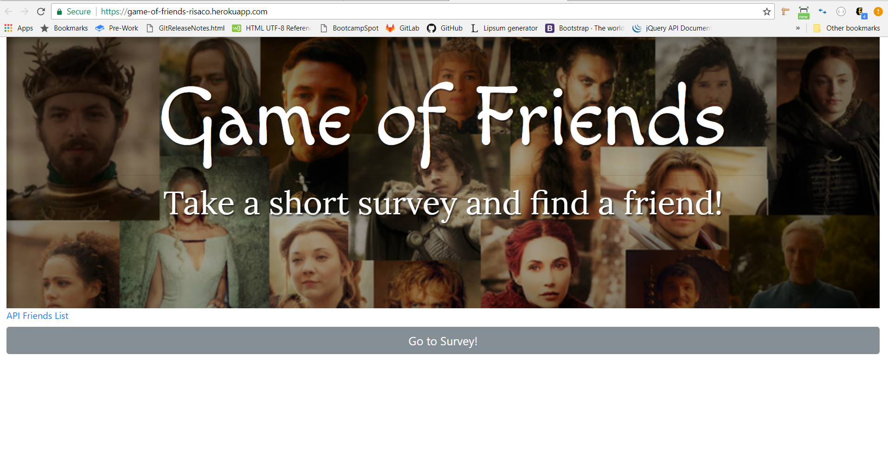
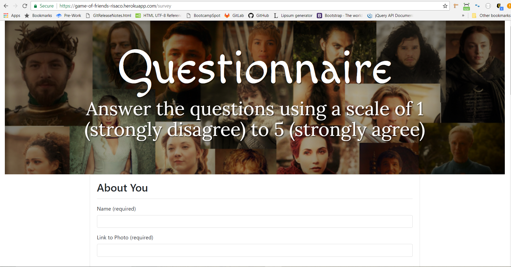
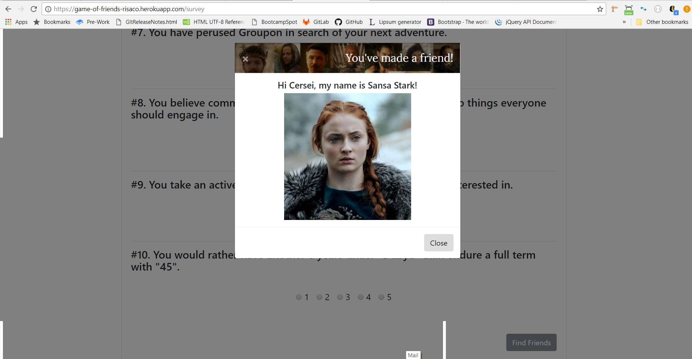

# Game of Friends
A full stack web application using node.js, Express and MySQL. This is a compatibility-based friend-finding application -- basically a dating app. This full-stack site will take in results from users' surveys, then compare their answers with those from other users. The app will then display the name and picture of the user with the best overall match.

### Use the App
This application is hosted on Heroku: [Click Me!](https://game-of-friends-risaco.herokuapp.com)
Answer the 10-question survey and be matched to a friend based on your answers!

### Home Screen

### Survey Screen

### Finding a Friend

### Technologies
HTML | CSS | JavaScript | AJAX | Bootstrap | MySQL

### Dependencies
express | mysql | body-parser
